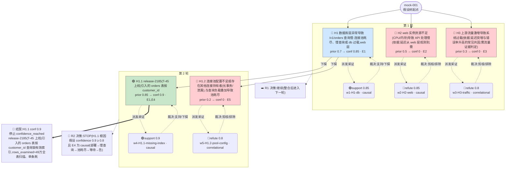

# 执行决策树 — mock-001-orchestrated-001

- 臂:`orchestrated` | 案例层级:`l1-mock` | 预算:`3` 轮 | 终态:`root_cause_concluded`
- 证据 `5` 条(correlational 2 / causal 3);轮次记录 `2`
- 评分:verdict=`located`,关键词命中 `5`(`release-2185,orders,customer_id,全表扫描,rows_examined`),误归因 `0`,需复核=`false`

> 本图由 `tools/render-tree.mjs` 从 state 机械生成;任何节点可回查 `runs/${runId}/state/*` 与 `analysis/scoring/${runId}.json`。节点色:🟢=concluded,🔵=supported,🔴=pruned/refuted,⚪=pending。

## 断言摘要(每条证据一句话,全文见 `runs/mock-001-orchestrated-001/state/evidence-chain.jsonl`)

| 证据 | 假设 | 轮 | verdict | conf | 类型 | 断言(截断)|
|------|------|----|---------|------|------|------------|
| E1 | H1 | 1 | support | 0.85 | causal | H1 成立(机制链 causal,含一处子句反证):/v1/orders 变慢的直接原因是数据库读路径慢查询——T-44.2 起 orders 表按 customer_id 的 S |
| E2 | H2 | 1 | refute | 0.85 | causal | H2(web 实例资源不足)不成立。CPU 子命题被直接反证:(1) 时序不成立——延迟恶化始于 T-40,此刻三实例 CPU 均基线 25-27%,web-2 首次抬升(T-30 |
| E3 | H3 | 1 | refute | 0.8 | correlational | H3(流量激增过载)不成立:症状峰值窗口 web-1/3 CPU 仅 36~41%、mysql CPU 峰值 59%,系统远未过载;唯一饱和点是连接池,504 失败原因均为等 db |
| E4 | H1.1 | 2 | support | 0.9 | causal | H1.1 成立(causal)。机制链每一环有直接观测且时序严格递进、量级匹配:(1) t=-45 部署 release-2185,明确 adds SELECT on orders |
| E5 | H1.2 | 2 | refute | 0.8 | correlational | 池耗尽的替代根因假设(配置不足/其他持有者)不成立:窗口内连接池上限无任何变更记录(deploy.log 仅日志采样调整与新增 SELECT 路径,均非池配置);慢查询出现前(T- |
