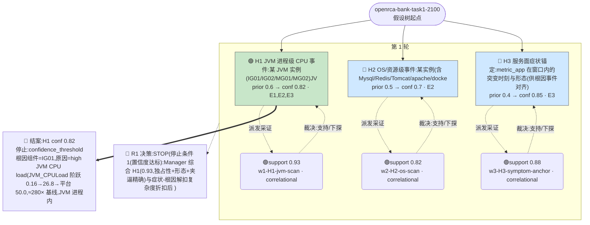

# 执行决策树 — openrca-bank-task1-2100-orchestrated-001

- 臂:`orchestrated` | 案例层级:`l2-openrca` | 预算:`4` 轮 | 终态:`root_cause_concluded`
- 证据 `3` 条(correlational 3 / causal 0);轮次记录 `1`
- 评分:verdict=`located`,关键词命中 `5`(`IG01,high,JVM,CPU,load`),误归因 `0`,需复核=`true`

> 本图由 `tools/render-tree.mjs` 从 state 机械生成;任何节点可回查 `runs/${runId}/state/*` 与 `analysis/scoring/${runId}.json`。节点色:🟢=concluded,🔵=supported,🔴=pruned/refuted,⚪=pending。

## 断言摘要(每条证据一句话,全文见 `runs/openrca-bank-task1-2100-orchestrated-001/state/evidence-chain.jsonl`)

| 证据 | 假设 | 轮 | verdict | conf | 类型 | 断言(截断)|
|------|------|----|---------|------|------|------------|
| E1 | H1 | 1 | support | 0.93 | correlational | 唯一候选事件:IG01 JVM_CPULoad(JVM-Operating System_7778_JVM_JVM_CPULoad)事件型异常(阶跃-平台-阶跃恢复,非锯齿基线)。 |
| E2 | H2 | 1 | support | 0.82 | correlational | 窗口 [0,+1800] 独占事件清单(60s 夹逼):① IG01 OS CPU 用户态突增(核心):末正常 660(25.79%)→首偏离 720(67.16%),区间 (21 |
| E3 | H3 | 1 | support | 0.88 | correlational | 症状锚定成立但锚点在追溯窗而非报障窗:报障窗 [0,+1800] metric_app 11 服务×101 采样 rr=sr=100 全平,trace 同平(span 4.2k-1 |
