# 执行决策树 — openrca-bank-task1-2100-ralph-001

- 臂:`ralph-baseline` | 案例层级:`l2-openrca` | 预算:`4` 轮 | 终态:`root_cause_concluded`
- 证据 `9` 条(correlational 8 / causal 1);轮次记录 `1`
- 评分:verdict=`located_needs_review`,关键词命中 `1`(`CPU`),误归因 `0`,需复核=`true`

> 本图由 `tools/render-tree.mjs` 从 state 机械生成;任何节点可回查 `runs/${runId}/state/*` 与 `analysis/scoring/${runId}.json`。节点色:🟢=concluded,🔵=supported,🔴=pruned/refuted,⚪=pending。

```mermaid
flowchart TD
  START(["openrca-bank-task1-2100<br/>假设树起点"])
  H0["⚪ H0 症状窗 [0,+1800](2021-03-04 21:00-21:30 UTC+8)内存在<br/>prior 1 → conf - "]
  START --> H0
  H1["⚪ H1 根因=apache02 主机上 apache 进程组 apache_10001 一个 wor<br/>prior 0.5 → conf 0.82 · E001,E002,E003,E004,E005,E006,E009"]
  H0 -->|下探| H1
  H2["🔴 H2 根因=Mysql02 慢查询/锁风暴(发生时刻≈t=-2820~-2760)导致窗内故障<br/>prior 0.2 → conf 0.05 · E007,E004,E009"]
  H0 -->|下探| H2
  H3["🔴 H3 根因=docker 容器层故障(dockerA/B 独立停顿,发生时刻≈t=-3120 或 <br/>prior 0.15 → conf 0.05 · E007,E004,E006"]
  H0 -->|下探| H3
  H4["🔴 H4 根因=IG01 JVM/主机 CPU 异常(JVM_CPULoad、CPUCpuUtil 升<br/>prior 0.05 → conf 0.03 · E008"]
  H0 -->|下探| H4
  H5["🔴 H5 根因=IG01 JVM 非堆内存泄漏<br/>prior 0.03 → conf 0.01 · E008"]
  H0 -->|下探| H5
  H6["🔴 H6 根因=Tomcat 主机内存压力(Tomcat02/03/04 MEMFreeMem 下降)<br/>prior 0.04 → conf 0.02 · E008"]
  H0 -->|下探| H6
  H7["🔴 H7 根因=Redis02 异常(keyspace_misses/used_cpu 变化,发生时刻<br/>prior 0.03 → conf 0.02 · E004"]
  H0 -->|下探| H7
  subgraph R1["第 1 轮"]
  E_E001("supported 0.9<br/>E001 · causal")
  H1 -.->|派发采证| E_E001
  E_E001 -.->|裁决:存疑| H1
  E_E002("supported 0.85<br/>E002 · correlational")
  H1 -.->|派发采证| E_E002
  E_E002 -.->|裁决:存疑| H1
  E_E003("supported 0.8<br/>E003 · correlational")
  H1 -.->|派发采证| E_E003
  E_E003 -.->|裁决:存疑| H1
  E_E004("supported 0.85<br/>E004 · correlational")
  H1 -.->|派发采证| E_E004
  E_E004 -.->|裁决:存疑| H1
  E_E005("supported 0.75<br/>E005 · correlational")
  H1 -.->|派发采证| E_E005
  E_E005 -.->|裁决:存疑| H1
  E_E006("weak 0.4<br/>E006 · correlational")
  H1 -.->|派发采证| E_E006
  E_E006 -.->|裁决:存疑| H1
  E_E007("supported 0.9<br/>E007 · correlational")
  H2 -.->|派发采证| E_E007
  E_E007 -.->|裁决:存疑| H2
  E_E008("supported 0.8<br/>E008 · correlational")
  H4 -.->|派发采证| E_E008
  E_E008 -.->|裁决:存疑| H4
  E_E009("supported 0.85<br/>E009 · correlational")
  H1 -.->|派发采证| E_E009
  E_E009 -.->|裁决:存疑| H1
  end
  D1["➡️ R1 决策:继续(整合后进入下一轮)"]
  R1 -.-> D1
  CONCL["🏁 结案: conf 0.82<br/>停止:<br/>"]
  H7 ==>|评测口径裁决| CONCL
  style H0 fill:#f5f5f5,stroke:#666
  style H1 fill:#f5f5f5,stroke:#666
  style H2 fill:#ffcdd2,stroke:#666
  style H3 fill:#ffcdd2,stroke:#666
  style H4 fill:#ffcdd2,stroke:#666
  style H5 fill:#ffcdd2,stroke:#666
  style H6 fill:#ffcdd2,stroke:#666
  style H7 fill:#ffcdd2,stroke:#666
```

## 断言摘要(每条证据一句话,全文见 `runs/openrca-bank-task1-2100-ralph-001/state/evidence-chain.jsonl`)

| 证据 | 假设 | 轮 | verdict | conf | 类型 | 断言(截断)|
|------|------|----|---------|------|------|------------|
| E001 | H1 | 1 | supported | 0.9 | causal | apache02 上进程组 apache_10001(PROCPPCount)于 t∈(+180,+240] 秒内从 6 阶跃降至 5,且持续至数据末端 t=+2400 从未恢复; |
| E002 | H1 | 1 | supported | 0.85 | correlational | 对照主机 apache01 同名进程组 KPI 全窗恒为 6.0(t=-3600..+2400 无任何变化),排除全局采集器伪影/同型进程组的共同变化,将阶跃定位到 apache0 |
| E003 | H1 | 1 | supported | 0.8 | correlational | 阶跃时刻 apache02 主机无资源类异常:ZABBIX_Host_Uptime 连续(6061282→6061342,未重启),MEMUsedMemPerc 恒 49%,CPU |
| E004 | H1 | 1 | supported | 0.85 | correlational | 窗内穷尽扫描(18 主机 × 全部 KPI 序列,基线=完整追溯窗 [-3600,0),MAD 下限取 'med'*1%,'z''5 且 ≥3 点):症状窗 [0,1800) 内唯 |
| E005 | H1 | 1 | supported | 0.75 | correlational | 症状窗内唯一超 3s 的调用停顿发生于 t=269/272:单条 trace gw0120210304210428486553(起始 21:04:28)经 Tomcat03→MG0 |
| E006 | H1 | 1 | weak | 0.4 | correlational | dockerB1/dockerB2 分钟 span 数在 t=240-300 同步下探(B1 597/539 vs 中位数 873;B2 393/562 vs 中位数 871),方 |
| E007 | H2 | 1 | supported | 0.9 | correlational | 追溯窗存在两组大幅异常但均在 t'0 且已恢复,不构成 [0,1800) 窗内单次故障的根因:(a) Mysql02 慢查询风暴 [-2820,-540](基线 ~0.03/s → |
| E008 | H4 | 1 | supported | 0.8 | correlational | IG01 的 JVM_CPULoad 全程基线 ~0.17,t=+240 时刻仍 0.158(未启动),仅在 t=360-600 瞬态冲至 26.8-50.0 后于 720 恢复; |
| E009 | H1 | 1 | supported | 0.85 | correlational | 窗内无服务级失败信号佐证故障为组件级:log_service.csv 仅 40 字节(表头,本窗无日志);四台 Tomcat ErrorCount 全窗恒定(0/2/0/4,无新增 |
