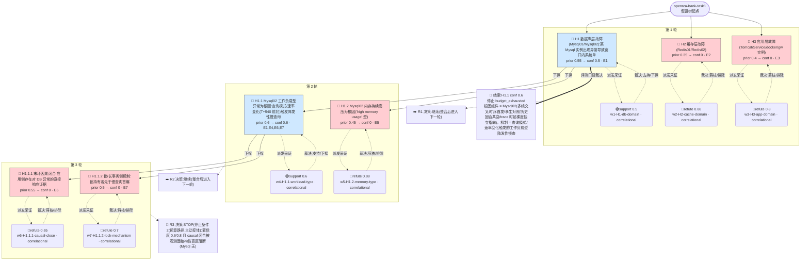

# 执行决策树 — openrca-bank-task1-orchestrated-001

- 臂:`orchestrated` | 案例层级:`l2-openrca` | 预算:`4` 轮 | 终态:`budget_exhausted`
- 证据 `7` 条(correlational 7 / causal 0);轮次记录 `3`
- 评分:verdict=`budget_exhausted`,关键词命中 `1`(`Mysql02`),误归因 `0`,需复核=`false`

> 本图由 `tools/render-tree.mjs` 从 state 机械生成;任何节点可回查 `runs/${runId}/state/*` 与 `analysis/scoring/${runId}.json`。节点色:🟢=concluded,🔵=supported,🔴=pruned/refuted,⚪=pending。

## 断言摘要(每条证据一句话,全文见 `runs/openrca-bank-task1-orchestrated-001/state/evidence-chain.jsonl`)

| 证据 | 假设 | 轮 | verdict | conf | 类型 | 断言(截断)|
|------|------|----|---------|------|------|------------|
| E1 | H1 | 1 | support | 0.5 | correlational | 最可疑组件=Mysql02,异常类型=症状窗内间歇性慢查询爆发(SlowQueries 基线0.03-0.5升至7-8.9@T+660/720、5.4@+1260、4.6-4.8@ |
| E2 | H2 | 1 | refute | 0.88 | correlational | 缓存域双实例全 KPI 稳态:内存无压力(used_memory 15-18MB vs 4GB maxmemory,'0.5%;evicted/blocked/rejected 全 |
| E3 | H3 | 1 | refute | 0.8 | correlational | 应用层域内全部组件平稳:Tomcat01-04 CPU 26-28%/JVM 堆基线包络/ErrorCount 恒定/GC 全 ParNew 小回收(0.02-0.09s,无 Fu |
| E4 | H1.1 | 2 | support | 0.6 | correlational | H1.1 成立:根因组件=Mysql02,原因类型=查询模式变化触发的工作负载型异常(慢查询爆发+行锁竞争,非资源耗尽:CPU≤51%/连接恒37/2000,Mysql01 对照全 |
| E5 | H1.2 | 2 | refute | 0.88 | correlational | H1.2 不成立(两条件均不满足):(1) 无事件型变化——Mysql02 MEMUsedMemPerc=98.0 于[-3600,+1800]每采样点恒定(先于窗口≥3600s  |
| E6 | H1.1.1 | 3 | refute | 0.65 | correlational | 末环按假设所述直接传递机制不闭合:(1) 日志负证据确凿——[600,900] timeout/lock wait/connection/pool/refuse/exception |
| E7 | H1.1.2 | 3 | refute | 0.7 | correlational | 锁/长事务机制假设被 refute(预注册判定:基线=安静段均值+3σ):(1) 无先导——Row Lock Time/Waits、ThreadsRunning、SlowQueri |
