# 执行决策树 — openrca-bank-task1-ralph-001

- 臂:`ralph-baseline` | 案例层级:`l2-openrca` | 预算:`4` 轮 | 终态:`root_cause_concluded`
- 证据 `29` 条(correlational 27 / causal 2);轮次记录 `3`
- 评分:verdict=`missed`,关键词命中 `0`(``),误归因 `0`,需复核=`false`

> 本图由 `tools/render-tree.mjs` 从 state 机械生成;任何节点可回查 `runs/${runId}/state/*` 与 `analysis/scoring/${runId}.json`。节点色:🟢=concluded,🔵=supported,🔴=pruned/refuted,⚪=pending。

```mermaid
flowchart TD
  START(["openrca-bank-task1<br/>假设树起点"])
  SYM["⚪ SYM 症状锚点(轮2精化): [0,1800]内三次用户可见停滞事件,机制统一为MG→docker<br/>prior 1 → conf 0.97 · EV-001,EV-003,EV-012,EV-020,EV-022"]
  START --> SYM
  H10["🟢 H10 根因(轮3结案)=MG→dockerB(trace-st)路径的选择性流级阻断(单向、间歇发<br/>prior 0.5 → conf 0.85 · EV-018,EV-019,EV-020,EV-022,EV-024,EV-025,EV-026"]
  SYM -->|下探| H10
  H10a["⚪ H10a 子假设(最佳机制): MG→dockerB方向网络路径按流丢包/黑洞(SDN/conntra<br/>prior 0.3 → conf 0.55 · EV-019,EV-022,EV-024,EV-025,EV-026"]
  H10 -->|下探| H10a
  H10b["🔴 H10b 子假设: dockerB内部预处理排队/accept队列间歇停顿<br/>prior 0.2 → conf 0.1 · EV-018,EV-021,EV-024,EV-025"]
  H10 -->|下探| H10b
  H1["⚪ H1 根因=Mysql02锁竞争: 仅与E2时间重合(EV-005/EV-015),E1/E3窗口<br/>prior 0.45 → conf 0.15 · EV-005,EV-011,EV-010,EV-014,EV-015"]
  SYM -->|下探| H1
  H2["🔴 H2 根因=MG侧连接池/队列耗尽: 已被EV-024同秒对照否证——同一秒内同源dle调用大多正<br/>prior 0.3 → conf 0.1 · EV-004,EV-018,EV-024,EV-026"]
  SYM -->|下探| H2
  H9["⚪ H9 根因=Mysql01角色变化(660起+2永久连接): Mysql01全程准空闲(buffe<br/>prior 0.1 → conf 0.05 · EV-010"]
  SYM -->|下探| H9
  CTX-PRE["⚪ CTX-PRE 上下文(轮3裁决完毕): (a)大事件[-3579,-2869]=重读批处理+dockerB<br/>prior 0.2 → conf 0.85 · EV-002,EV-021,EV-027,EV-028,EV-029"]
  SYM -->|下探| CTX-PRE
  H3["🔴 H3 根因=Redis01间歇停顿<br/>prior 0.15 → conf 0.03 · EV-007,EV-016"]
  SYM -->|下探| H3
  H4["🔴 H4 根因=MG01 CPU-2核饱和始于(-1560,-1320]<br/>prior 0.4 → conf 0.05 · EV-006"]
  SYM -->|下探| H4
  H5["🔴 H5 根因=Redis资源故障(阻塞/逐出/fork/CPU/内存)<br/>prior 0.25 → conf 0.03 · EV-007,EV-016"]
  SYM -->|下探| H5
  H6["🔴 H6 根因=docker容器资源故障(CPU限流/内存泄漏)<br/>prior 0.25 → conf 0.05 · EV-008,EV-019"]
  SYM -->|下探| H6
  H7["🔴 H7 根因=网关/Tomcat JVM故障(GC长停顿/重启/内存泄漏)<br/>prior 0.25 → conf 0.08 · EV-009,EV-018"]
  SYM -->|下探| H7
  TOPO["⚪ TOPO 拓扑事实(轮2修正,以parent_id链为准): apache→IG01/02 —(in)<br/>prior 1 → conf 0.9 · EV-013,EV-017"]
  START --> TOPO
  CTX-DB["⚪ CTX-DB DB事实: Mysql02活动库,Mysql01准空闲;Mysql02缓冲池健康;[480,<br/>prior 1 → conf 0.85 · EV-010,EV-011,EV-023"]
  START --> CTX-DB
  subgraph R1["第 1 轮"]
  E_EV_001("confirmed 0.95<br/>EV-001 · correlational")
  SYM -.->|派发采证| E_EV_001
  E_EV_001 -.->|裁决:存疑| SYM
  E_EV_002("confirmed 0.9<br/>EV-002 · correlational")
  CTX-PRE -.->|派发采证| E_EV_002
  E_EV_002 -.->|裁决:存疑| CTX-PRE
  E_EV_003("confirmed 0.95<br/>EV-003 · correlational")
  SYM -.->|派发采证| E_EV_003
  E_EV_003 -.->|裁决:存疑| SYM
  E_EV_004("confirmed 0.85<br/>EV-004 · correlational")
  H-WAIT -.->|派发采证| E_EV_004
  E_EV_005("confirmed 0.8<br/>EV-005 · correlational")
  H1 -.->|派发采证| E_EV_005
  E_EV_005 -.->|裁决:存疑| H1
  E_EV_006("confirmed 0.9<br/>EV-006 · correlational")
  H4 -.->|派发采证| E_EV_006
  E_EV_006 -.->|裁决:存疑| H4
  E_EV_007("confirmed 0.85<br/>EV-007 · correlational")
  H5 -.->|派发采证| E_EV_007
  E_EV_007 -.->|裁决:存疑| H5
  E_EV_008("confirmed 0.85<br/>EV-008 · correlational")
  H6 -.->|派发采证| E_EV_008
  E_EV_008 -.->|裁决:存疑| H6
  E_EV_009("confirmed 0.85<br/>EV-009 · correlational")
  H7 -.->|派发采证| E_EV_009
  E_EV_009 -.->|裁决:存疑| H7
  E_EV_010("confirmed 0.85<br/>EV-010 · correlational")
  CTX-DB -.->|派发采证| E_EV_010
  E_EV_010 -.->|裁决:存疑| CTX-DB
  E_EV_011("confirmed 0.7<br/>EV-011 · correlational")
  H1 -.->|派发采证| E_EV_011
  E_EV_011 -.->|裁决:存疑| H1
  E_EV_012("confirmed 0.85<br/>EV-012 · correlational")
  SYM -.->|派发采证| E_EV_012
  E_EV_012 -.->|裁决:存疑| SYM
  E_EV_013("confirmed 0.8<br/>EV-013 · correlational")
  TOPO -.->|派发采证| E_EV_013
  E_EV_013 -.->|裁决:存疑| TOPO
  end
  D1["➡️ R1 决策:继续(整合后进入下一轮)"]
  R1 -.-> D1
  subgraph R2["第 2 轮"]
  E_EV_014("confirmed 0.92<br/>EV-014 · correlational")
  H1 -.->|派发采证| E_EV_014
  E_EV_014 -.->|裁决:存疑| H1
  E_EV_015("confirmed 0.85<br/>EV-015 · correlational")
  H1 -.->|派发采证| E_EV_015
  E_EV_015 -.->|裁决:存疑| H1
  E_EV_016("confirmed 0.9<br/>EV-016 · correlational")
  H3 -.->|派发采证| E_EV_016
  E_EV_016 -.->|裁决:存疑| H3
  E_EV_017("confirmed 0.9<br/>EV-017 · correlational")
  TOPO -.->|派发采证| E_EV_017
  E_EV_017 -.->|裁决:存疑| TOPO
  E_EV_018("confirmed 0.88<br/>EV-018 · causal")
  H10 -.->|派发采证| E_EV_018
  E_EV_018 -.->|裁决:存疑| H10
  E_EV_019("confirmed 0.85<br/>EV-019 · correlational")
  H10 -.->|派发采证| E_EV_019
  E_EV_019 -.->|裁决:存疑| H10
  E_EV_020("confirmed 0.92<br/>EV-020 · correlational")
  SYM -.->|派发采证| E_EV_020
  E_EV_020 -.->|裁决:存疑| SYM
  E_EV_021("confirmed 0.82<br/>EV-021 · correlational")
  CTX-PRE -.->|派发采证| E_EV_021
  E_EV_021 -.->|裁决:存疑| CTX-PRE
  E_EV_022("confirmed 0.9<br/>EV-022 · correlational")
  SYM -.->|派发采证| E_EV_022
  E_EV_022 -.->|裁决:存疑| SYM
  E_EV_023("confirmed 0.8<br/>EV-023 · correlational")
  CTX-DB -.->|派发采证| E_EV_023
  E_EV_023 -.->|裁决:存疑| CTX-DB
  end
  D2["➡️ R2 决策:继续(整合后进入下一轮)"]
  R2 -.-> D2
  subgraph R3["第 3 轮"]
  E_EV_024("confirmed 0.9<br/>EV-024 · causal")
  H10 -.->|派发采证| E_EV_024
  E_EV_024 -.->|裁决:存疑| H10
  E_EV_025("confirmed 0.85<br/>EV-025 · correlational")
  H10a -.->|派发采证| E_EV_025
  E_EV_025 -.->|裁决:存疑| H10a
  E_EV_026("confirmed 0.85<br/>EV-026 · correlational")
  H10 -.->|派发采证| E_EV_026
  E_EV_026 -.->|裁决:存疑| H10
  E_EV_027("confirmed 0.92<br/>EV-027 · correlational")
  SYM -.->|派发采证| E_EV_027
  E_EV_027 -.->|裁决:存疑| SYM
  E_EV_028("confirmed 0.88<br/>EV-028 · correlational")
  CTX-PRE -.->|派发采证| E_EV_028
  E_EV_028 -.->|裁决:存疑| CTX-PRE
  E_EV_029("confirmed 0.85<br/>EV-029 · correlational")
  SYM -.->|派发采证| E_EV_029
  E_EV_029 -.->|裁决:存疑| SYM
  end
  D3["➡️ R3 决策:继续(整合后进入下一轮)"]
  R3 -.-> D3
  CONCL["🏁 结案: conf 0.85<br/>停止:<br/>"]
  H10 ==> CONCL
  style SYM fill:#cfe8ff,stroke:#666
  style H10 fill:#c8e6c9,stroke:#666
  style H10a fill:#f5f5f5,stroke:#666
  style H10b fill:#ffcdd2,stroke:#666
  style H1 fill:#f5f5f5,stroke:#666
  style H2 fill:#ffcdd2,stroke:#666
  style H9 fill:#f5f5f5,stroke:#666
  style CTX-PRE fill:#cfe8ff,stroke:#666
  style H3 fill:#ffcdd2,stroke:#666
  style H4 fill:#ffcdd2,stroke:#666
  style H5 fill:#ffcdd2,stroke:#666
  style H6 fill:#ffcdd2,stroke:#666
  style H7 fill:#ffcdd2,stroke:#666
  style TOPO fill:#cfe8ff,stroke:#666
  style CTX-DB fill:#cfe8ff,stroke:#666
```

## 断言摘要(每条证据一句话,全文见 `runs/openrca-bank-task1-ralph-001/state/evidence-chain.jsonl`)

| 证据 | 假设 | 轮 | verdict | conf | 类型 | 断言(截断)|
|------|------|----|---------|------|------|------------|
| EV-001 | SYM | 1 | confirmed | 0.95 | correlational | 症状窗[0,1800]内存在三次多服务停滞事件:E1=[252,280]s、E2=[643,706]s、E3=[857,886]s;apache访问日志中'5s请求集中成簇,大量请 |
| EV-002 | CTX-PRE | 1 | confirmed | 0.9 | correlational | T0前[-3579,-2869]存在更严重的同类事件:数以百计'5s请求(ServiceTest4为主,大量精确10.01-10.03s),伴随Mysql02重压(Rows Rea |
| EV-003 | SYM | 1 | confirmed | 0.95 | correlational | 全数据集无HTTP错误:两访问日志0条非200状态;metric_app的sr(成功率)全程=100。故障纯粹表现为时延/吞吐型(无错误率型) |
| EV-004 | H-WAIT | 1 | confirmed | 0.85 | correlational | 三次事件期间分层定位:IG/MG/Tomcat层span最大10-15s,而docker层(dockerA1/A2/B1/B2)span均值26-83ms与平静期无异(最大2-6s |
| EV-005 | H1 | 1 | confirmed | 0.8 | correlational | Mysql02窗内锁竞争突发与E2精确重合且随后恶化:SlowQueries/RowLockTime/ThreadsRunning在660-720(SlowQ 7.05/8.9,  |
| EV-006 | H4 | 1 | confirmed | 0.9 | correlational | MG01 CPU-2在(-1560,-1320]从2.4%跳到100%并保持是热核迁移伪象而非新故障:迁移前CPU-3为100%(-1680:100,-1560:99.78)迁移后 |
| EV-007 | H5 | 1 | confirmed | 0.85 | correlational | Redis两节点资源面干净:blocked_clients=0(全程)、evicted_keys=0、latest_fork_usec=0、rejected无异常;Redis01  |
| EV-008 | H6 | 1 | confirmed | 0.85 | correlational | docker容器资源面干净:MemPercent全程恒定(A1 58.35/A2 59.26/B1 60.43),MemUsage~2.1GB/3.07GB限额平稳,CpuPerc |
| EV-009 | H7 | 1 | confirmed | 0.85 | correlational | IG/MG网关JVM健康:uptime单调递增(~190万秒,无重启)、堆内存正常锯齿(10-58%并回落)、IG01堆上限恒定2.04GB、无Full GC(gc日志仅ParNe |
| EV-010 | CTX-DB | 1 | confirmed | 0.85 | correlational | Mysql02为活动库、Mysql01为准空闲备库:Mysql02 Rows Read 1.2-3.4万/60s vs Mysql01 200-1850;Mysql01 buffe |
| EV-011 | H1 | 1 | confirmed | 0.7 | correlational | Mysql02缓冲池健康否决读放大假设:buffer pool物理读全程≈0、free页~8190平坦、无脏页堆积或池收缩;E1/E3时刻的60s采样点(240:RowLock 1 |
| EV-012 | SYM | 1 | confirmed | 0.85 | correlational | 窗内整体服务时延轻度抬升(~1.1-1.7x)叠加事件突发:apache口径per-service窗均值/基线比 ServiceTest3 1.66、ServiceTest9 1. |
| EV-013 | TOPO | 1 | confirmed | 0.8 | correlational | 调用拓扑(trace共现推断):apache(k6入口)→IG01/02(JVM:7778)→MG01/02(JVM:7779)→Tomcat01-04(:8003)全互联网格→d |
| EV-014 | H1 | 2 | confirmed | 0.92 | correlational | E1/E3窗口Mysql02完全无DB信号: RowLockTime 300=0.05/840=0.0492/900=0.2373(对照E2的660=4.42/720=6.48), |
| EV-015 | H1 | 2 | confirmed | 0.85 | correlational | E2的DB突发是锁冲突而非负载: Queries 660=471(全窗321-516正常带), Rows Read 660=20156(带10791-19549上沿), 而RowL |
| EV-016 | H3 | 2 | confirmed | 0.9 | correlational | Redis01深查[240,700]干净: uptime_in_seconds 4474563→4474984单调(+421s/420s无重启), rejected_connect |
| EV-017 | TOPO | 2 | confirmed | 0.9 | correlational | 调用链修正(以parent_id链为准,取代EV-013的共现推断排序): apache→IG01/02 —(in)→ Tomcat01-04 —(st)→ MG01/02 —(d |
| EV-018 | H10 | 2 | confirmed | 0.88 | causal | 请求内定位(嵌套span算术,因果性): E1全部9条'=9s慢trace的附加时延精确进入MG→dockerB的dle跳——MG server span时长==其dle子span |
| EV-019 | H10 | 2 | confirmed | 0.85 | correlational | E1/E3期间dockerB并未停机: dockerB1/B2的span发射速率与基线无异(E1窗口B1 5-107/s、B2 3-114/s; E3窗口B1 2-115/s、B2 |
| EV-020 | SYM | 2 | confirmed | 0.92 | correlational | 事件精确时刻(秒级): E1爬升230-232→主爆[232,258]→尾289(n2000从背景~5升至30+/s); E3爬升837-839→主爆[840,865]→尾886; |
| EV-021 | CTX-PRE | 2 | confirmed | 0.82 | correlational | T0前微事件[-86,-66]为dockerB执行慢型(dockerB1 server+trace'=5s共20条、dockerB2共16条)且无MySQL信号(RowLock - |
| EV-022 | SYM | 2 | confirmed | 0.9 | correlational | apache口径用户可见影响: E1[252,280]约26条'5s、E2[643,706]约27条、E3[857,886]约38条;10.01-10.02s紧簇=上层10s超时截 |
| EV-023 | CTX-DB | 2 | confirmed | 0.8 | correlational | [480,540]后端微事件: dockerA1(role)8+7条、dockerA2 3+3、dockerB1(trace)11+10、dockerB2 9+8条'=5s(ser |
| EV-024 | H10 | 3 | confirmed | 0.9 | causal | 同秒对照因果定位(到达侧差分): E1窗口挂起dle调用('=4s,n=59,[225,265])在[225,299]全窗内于dockerB侧产生0条以该dle span为pare |
| EV-025 | H10a | 3 | confirmed | 0.85 | correlational | 方向不对称: 爆发期间dockerB→MG回调方向完全健康——E1[231,258]回调span n=218、'=2s=0、max 1028ms;E3[840,862] n=210 |
| EV-026 | H10 | 3 | confirmed | 0.85 | correlational | MG×dockerB回调为全网格非粘性配对: [0,300]内MG01↔ac100524-1=487、MG01↔ac100629-1=522、MG02↔ac100524-1=485 |
| EV-027 | SYM | 3 | confirmed | 0.92 | correlational | 根因时刻秒级锚定: E1首 deviation=+231s(首个dle 4858ms;226-230秒dle'=2s全为0;232起2条'=5s/7552ms,双亚爆发[231,2 |
| EV-028 | CTX-PRE | 3 | confirmed | 0.88 | correlational | 时刻裁决: -86s事件非dle-挂起族——[-95,-60]内dle'=2s仅7条零星(最大4834ms,-90)且无成簇,同期dockerB执行慢span 2-10条/秒为慢性 |
| EV-029 | SYM | 3 | confirmed | 0.85 | correlational | 持续性与终止: 900s后无dle-挂起爆发(分钟15-39的MGdle 0-9/min、max 5-7.4s=噪声底水平),dockerB执行慢慢性滴漏延续(0-7/min),a |
