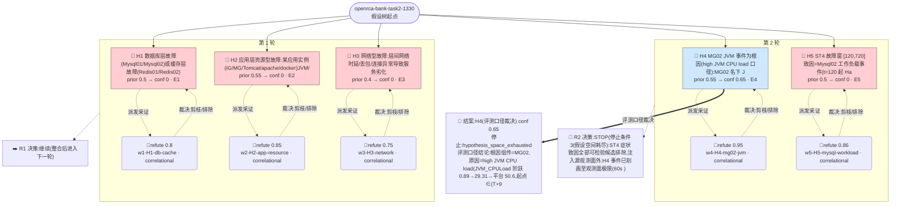

# 执行决策树 — openrca-bank-task2-1330-orchestrated-001

- 臂:`orchestrated` | 案例层级:`l2-openrca` | 预算:`4` 轮 | 终态:`hypothesis_space_exhausted`
- 证据 `5` 条(correlational 5 / causal 0);轮次记录 `2`
- 评分:verdict=`escalated`,关键词命中 `5`(`MG02,high,JVM,CPU,load`),误归因 `0`,需复核=`false`

> 本图由 `tools/render-tree.mjs` 从 state 机械生成;任何节点可回查 `runs/${runId}/state/*` 与 `analysis/scoring/${runId}.json`。节点色:🟢=concluded,🔵=supported,🔴=pruned/refuted,⚪=pending。

## 断言摘要(每条证据一句话,全文见 `runs/openrca-bank-task2-1330-orchestrated-001/state/evidence-chain.jsonl`)

| 证据 | 假设 | 轮 | verdict | conf | 类型 | 断言(截断)|
|------|------|----|---------|------|------|------------|
| E1 | H1 | 1 | refute | 0.8 | correlational | 数据/缓存域四实例窗内无故障级异常:Redis01/02 引擎 KPI 全程恒稳(clients 601/402 恒、rejected/evicted/blocked 全 0、op |
| E2 | H2 | 1 | refute | 0.85 | correlational | 应用/容器实例无窗口对齐的资源异常:CPU 25-27% 恒定(IG/MG/Tomcat)、堆锯齿 11-57% 无饱和、GC 窗口 41 次 vs 基线 40 次全 ParNew |
| E3 | H3 | 1 | refute | 0.75 | correlational | 网络型故障不成立:18 实例 NETInErr/NETOutErr 全时段 0、带宽利用率 '0.2%、DefaultRoute 恒通、CLOSE-WAIT/FIN-WAIT 仅追 |
| E4 | H4 | 2 | refute | 0.95 | correlational | (a) 存在性成立:MG02 JVM_CPULoad(JVM-Operating System_7779_JVM_JVM_CPULoad)事件型阶跃+平台,起点 ∈(T+900,T |
| E5 | H5 | 2 | refute | 0.86 | correlational | (1) 时间线不成立:Handler Read Next 唯一主尖峰 t=540(8007,单点),t=120-480 全 0(ST4 最深劣化 t=180 时 RdNext=0) |
