# 执行决策树 — openrca-bank-task2-1330-ralph-001

- 臂:`ralph-baseline` | 案例层级:`l2-openrca` | 预算:`4` 轮 | 终态:`root_cause_concluded`
- 证据 `12` 条(correlational 10 / causal 2);轮次记录 `2`
- 评分:verdict=`missed`,关键词命中 `0`(``),误归因 `0`,需复核=`false`

> 本图由 `tools/render-tree.mjs` 从 state 机械生成;任何节点可回查 `runs/${runId}/state/*` 与 `analysis/scoring/${runId}.json`。节点色:🟢=concluded,🔵=supported,🔴=pruned/refuted,⚪=pending。

```mermaid
flowchart TD
  START(["openrca-bank-task2-1330<br/>假设树起点"])
  H-SYM["⚪ H-SYM 症状锚点(非根因假设):ServiceTest4(/UOCP/base/ServiceTes<br/>prior 1 → conf 0.95 · E1,E2,E3,E7,E10"]
  START --> H-SYM
  H1["🟢 H1 根因=数据库侧(MySQL)执行层劣化:Mysql02 承载 CPU 密集全表扫描查询负载(<br/>prior 0.45 → conf 0.8 · E3,E4,E5,E10,E11,E12"]
  H-SYM -->|下探| H1
  H1a["⚪ H1a 细化(已降级):t=120 的双库行锁尖峰(Mysql02 24.83 / Mysql01 <br/>prior 0.35 → conf 0.25 · E5,E11"]
  H1 -->|下探| H1a
  H1b["🔴 H1b 备选细化:连接池/线程池排队(ThreadsRunning 高企、Max Used Conn<br/>prior 0.1 → conf 0.05 · E11"]
  H1 -->|下探| H1b
  H1c["⚪ H1c 驱动机制(本轮确立):Mysql02 CPU 密集全表扫描查询负载是子调用 0.4-4.5s<br/>prior 0.3 → conf 0.8 · E4,E7,E10,E11,E12"]
  H1 -->|下探| H1c
  H2["🔴 H2 根因=docker 容器层(role-st/trace-st,即 dockerA1/A2/B<br/>prior 0.15 → conf 0.05 · E3,E6,E10"]
  H-SYM -->|下探| H2
  H3["🔴 H3 根因=Redis 缓存故障(驱逐/阻塞/拒绝连接)。<br/>prior 0.15 → conf 0.03 · E6"]
  H-SYM -->|下探| H3
  H4["🔴 H4 根因=主机资源饱和(CPU/内存/磁盘 IO/网络)。<br/>prior 0.15 → conf 0.05 · E6"]
  H-SYM -->|下探| H4
  H5["🔴 H5 根因=JVM GC 风暴(Tomcat/MG 层 Full GC 停顿)。<br/>prior 0.05 → conf 0.03 · E8"]
  H-SYM -->|下探| H5
  H6["🔴 H6 根因=网络丢包/链路劣化(层间通信)。<br/>prior 0.05 → conf 0.03 · E9"]
  H-SYM -->|下探| H6
  subgraph R1["第 1 轮"]
  E_E1("confirmed 0.95<br/>E1 · correlational")
  H-SYM -.->|派发采证| E_E1
  E_E1 -.->|裁决:存疑| H-SYM
  E_E2("confirmed 0.95<br/>E2 · correlational")
  H-SYM -.->|派发采证| E_E2
  E_E2 -.->|裁决:存疑| H-SYM
  E_E3("confirmed 0.85<br/>E3 · causal")
  H1 -.->|派发采证| E_E3
  E_E3 -.->|裁决:存疑| H1
  E_E4("confirmed 0.85<br/>E4 · correlational")
  H1 -.->|派发采证| E_E4
  E_E4 -.->|裁决:存疑| H1
  E_E5("confirmed 0.7<br/>E5 · correlational")
  H1 -.->|派发采证| E_E5
  E_E5 -.->|裁决:存疑| H1
  E_E6("confirmed 0.8<br/>E6 · correlational")
  H3 -.->|派发采证| E_E6
  E_E6 -.->|裁决:存疑| H3
  E_E7("confirmed 0.8<br/>E7 · correlational")
  H-SYM -.->|派发采证| E_E7
  E_E7 -.->|裁决:存疑| H-SYM
  end
  D1["➡️ R1 决策:继续(整合后进入下一轮)"]
  R1 -.-> D1
  subgraph R2["第 2 轮"]
  E_E8("confirmed 0.9<br/>E8 · correlational")
  H5 -.->|派发采证| E_E8
  E_E8 -.->|裁决:存疑| H5
  E_E9("confirmed 0.9<br/>E9 · correlational")
  H6 -.->|派发采证| E_E9
  E_E9 -.->|裁决:存疑| H6
  E_E10("confirmed 0.85<br/>E10 · causal")
  H1 -.->|派发采证| E_E10
  E_E10 -.->|裁决:存疑| H1
  E_E11("confirmed 0.85<br/>E11 · correlational")
  H1b -.->|派发采证| E_E11
  E_E11 -.->|裁决:存疑| H1b
  E_E12("confirmed 0.85<br/>E12 · correlational")
  H1 -.->|派发采证| E_E12
  E_E12 -.->|裁决:存疑| H1
  end
  D2["➡️ R2 决策:继续(整合后进入下一轮)"]
  R2 -.-> D2
  CONCL["🏁 结案: conf undefined<br/>停止:<br/>"]
  H1 ==> CONCL
  style H-SYM fill:#cfe8ff,stroke:#666
  style H1 fill:#c8e6c9,stroke:#666
  style H1a fill:#f5f5f5,stroke:#666
  style H1b fill:#ffcdd2,stroke:#666
  style H1c fill:#cfe8ff,stroke:#666
  style H2 fill:#ffcdd2,stroke:#666
  style H3 fill:#ffcdd2,stroke:#666
  style H4 fill:#ffcdd2,stroke:#666
  style H5 fill:#ffcdd2,stroke:#666
  style H6 fill:#ffcdd2,stroke:#666
```

## 断言摘要(每条证据一句话,全文见 `runs/openrca-bank-task2-1330-ralph-001/state/evidence-chain.jsonl`)

| 证据 | 假设 | 轮 | verdict | conf | 类型 | 断言(截断)|
|------|------|----|---------|------|------|------------|
| E1 | H-SYM | 1 | confirmed | 0.95 | correlational | 受害服务定位:ServiceTest4 是窗口内唯一发生响应率(rr)崩溃的服务,rr 从 t=120 起跌(94.52),t=180 最低 40.54(mrt 7512ms),t |
| E2 | H-SYM | 1 | confirmed | 0.95 | correlational | 失败形态=10 秒超时而非 HTTP 错误:窗口内 apache/tomcat 访问日志中 ServiceTest4 无任何非 200 状态;但 ST4 请求大量命中 ~10.0x |
| E3 | H1 | 1 | confirmed | 0.85 | causal | 请求级因果链:trace gw0120210304133300327733 (始于 t=180, 13:33:00.327) 即上述 ST4 超时请求——IG02 span 100 |
| E4 | H1 | 1 | confirmed | 0.85 | correlational | Mysql02 承载慢性重扫描负载,且在故障结束时骤停:Rows Read 全程[-3600, t720]维持 39 万-79 万/采样区间(健康期 t≥840 仅 0.5-4.7 |
| E5 | H1 | 1 | confirmed | 0.7 | correlational | 行锁等待在故障起始时刻出现急性尖峰,与慢性扫描负载分层:Mysql02 'Innodb Row Lock Time' 在 t=120 达 24.83(全时间线最大值,典型 0.4- |
| E6 | H3 | 1 | confirmed | 0.8 | correlational | 排除 Redis 与资源饱和:Redis01/02 全窗口 blocked_clients=0、evicted_keys=0、rejected_connections=0、used |
| E7 | H-SYM | 1 | confirmed | 0.8 | correlational | 恢复时刻定位:全系统(12 个被追踪组件)span 平均/最大时长在 t≈660-720 发生阶跃式下降(最大时长不再触及 10-20s 超时帽),Mysql02 慢查询/扫描负载 |
| E8 | H5 | 2 | confirmed | 0.9 | correlational | H5(JVM GC 风暴)排除:log_service 全文件 grep 'Full GC' 零匹配;全部 gc 日志仅来自 Tomcat01-04(各 32-34 行,MG/ap |
| E9 | H6 | 2 | confirmed | 0.9 | correlational | H6(网络丢包/链路劣化)排除:metric_container 窗口 [0,720] 内 9 个携带 NET KPI 的主机(IG01/02、MG01/02、Redis01、To |
| E10 | H1 | 2 | confirmed | 0.85 | causal | 慢 trace gw0120210304133300327733 全 45 行 span 树解码+系统拓扑发现:(1) 链路 IG02(10019,根 span 自父)→in-wa |
| E11 | H1b | 2 | confirmed | 0.85 | correlational | H1b(连接/线程池排队)排除,且持续性行锁排队机制排除:(双库 [-3600,840])Threads Created=0、Slow launch threads=0、Abort |
| E12 | H1 | 2 | confirmed | 0.85 | correlational | 持续驱动=Mysql02 CPU 密集全表扫描负载,包络与故障窗精确同始同终且内部无 IO/缓冲瓶颈:逐分钟 [0,720] SlowQueries 17.4-25.8/s、Row |
