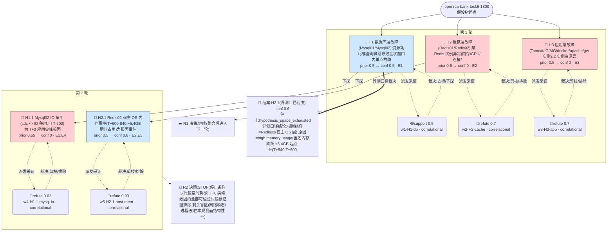

# 执行决策树 — openrca-bank-task6-1800-orchestrated-001

- 臂:`orchestrated` | 案例层级:`l2-openrca` | 预算:`4` 轮 | 终态:`hypothesis_space_exhausted`
- 证据 `5` 条(correlational 5 / causal 0);轮次记录 `2`
- 评分:verdict=`escalated`,关键词命中 `4`(`Redis02,high,memory,usage`),误归因 `0`,需复核=`false`

> 本图由 `tools/render-tree.mjs` 从 state 机械生成;任何节点可回查 `runs/${runId}/state/*` 与 `analysis/scoring/${runId}.json`。节点色:🟢=concluded,🔵=supported,🔴=pruned/refuted,⚪=pending。

## 断言摘要(每条证据一句话,全文见 `runs/openrca-bank-task6-1800-orchestrated-001/state/evidence-chain.jsonl`)

| 证据 | 假设 | 轮 | verdict | conf | 类型 | 断言(截断)|
|------|------|----|---------|------|------|------------|
| E1 | H1 | 1 | support | 0.5 | correlational | 最可疑=Mysql02,IO 争用型查询异常(非资源耗尽):SlowQueries 自 T-600 爬升(基线 0.2-4 → 11.5@-600 → 27.5@-300 → 峰值 |
| E2 | H2 | 1 | refute | 0.7 | correlational | Redis 实例级全 KPI 稳态(used_memory 13-16MB vs 4GB maxmemory、零 evicted/blocked/rejected、命中率/ops/ |
| E3 | H3 | 1 | refute | 0.7 | correlational | 应用层实例无资源/网络异常:CPU ~26% 平坦、堆在 t=0 反而下降、零 Full GC/OOM/kill、ParNew'0.1s、磁盘 busy≤5%、docker 平坦、 |
| E4 | H1.1 | 2 | refute | 0.62 | correlational | Mysql02 IO 争用是真实但与 T+0 事件无关的慢性背景劣化:(1) 劣化 T-600/-660 一步台阶后为平台(CPUWio 25.7→24-29% 稳定、sdc bu |
| E5 | H2.1 | 2 | refute | 0.93 | correlational | Redis02 宿主内存事件刻画(非根因裁决,事实部分为结案关键):(1) 起点 ∈(T+540,T+600](T+540 仍基线 23%/1668MB,T+600 单采样阶跃 9 |
