# 执行决策树 — openrca-bank-task6-1800-ralph-001

- 臂:`ralph-baseline` | 案例层级:`l2-openrca` | 预算:`4` 轮 | 终态:`root_cause_concluded`
- 证据 `18` 条(correlational 16 / causal 2);轮次记录 `2`
- 评分:verdict=`missed`,关键词命中 `0`(``),误归因 `0`,需复核=`false`

> 本图由 `tools/render-tree.mjs` 从 state 机械生成;任何节点可回查 `runs/${runId}/state/*` 与 `analysis/scoring/${runId}.json`。节点色:🟢=concluded,🔵=supported,🔴=pruned/refuted,⚪=pending。

```mermaid
flowchart TD
  START(["openrca-bank-task6-1800<br/>假设树起点"])
  H-SYMPTOM["⚪ H-SYMPTOM 症状锚点: t=0 桶(18:00:00-18:01:00)单次 60s 全服务时延尖峰,r<br/>prior 1 → conf 0.98 · E1,E2,E4,E14"]
  START --> H-SYMPTOM
  H-MYSQL2["⚪ H-MYSQL2 根因=Mysql02(根因组件)。机制: 自 t≈-600 的行锁/慢查询竞争爬坡(E8,慢<br/>prior 0.5 → conf 0.85 · E8,E12,E13,E14,E15,E16,E18"]
  H-SYMPTOM -->|下探| H-MYSQL2
  H-MYSQL2-BURST["⚪ H-MYSQL2-BURST 已验证: 事件分钟存在 mysqld 侧急性事件=检查点型猛烈刷脏(E13);原候选中的连接<br/>prior 0.5 → conf 0.8 · E13,E15"]
  H-MYSQL2 -->|下探| H-MYSQL2-BURST
  H-INFRA["🔴 H-INFRA 根因=应用层主机共享基础设施 60s 抖动(共享存储 fsync 停顿或虚拟化/网络抖动)。<br/>prior 0.35 → conf 0.08 · E3,E9,E12,E15,E17"]
  H-SYMPTOM -->|下探| H-INFRA
  H-TOMCAT2["🔴 H-TOMCAT2 根因=Tomcat02 本地故障(GC/线程池/主机)。<br/>prior 0.4 → conf 0.05 · E4,E5"]
  H-SYMPTOM -->|下探| H-TOMCAT2
  H-REDIS["🔴 H-REDIS 根因=Redis01/02 缓存时延/拒绝。<br/>prior 0.3 → conf 0.03 · E6"]
  H-SYMPTOM -->|下探| H-REDIS
  H-MGJVM["🔴 H-MGJVM 根因=MG 层 JVM 停顿(GC/STW)。<br/>prior 0.3 → conf 0.05 · E7,E12,E18"]
  H-SYMPTOM -->|下探| H-MGJVM
  H-NETTCP["🔴 H-NETTCP 根因=TCP 连接层故障(CLOSE-WAIT 堆积/连接表耗尽/网卡特例)。<br/>prior 0.2 → conf 0.05 · E10"]
  H-INFRA -->|下探| H-NETTCP
  ARTIFACT["⚪ ARTIFACT 数据工件记录(非假设): MG→docker span 父子链自 bucket -60 起消<br/>prior - → conf 0.8 · E11"]
  START --> ARTIFACT
  subgraph R1["第 1 轮"]
  E_E1("supports 0.98<br/>E1 · correlational")
  SYMPTOM -.->|派发采证| E_E1
  E_E2("supports 0.97<br/>E2 · correlational")
  SYMPTOM -.->|派发采证| E_E2
  E_E3("supports 0.9<br/>E3 · correlational")
  H-SYSLAT -.->|派发采证| E_E3
  E_E4("supports 0.92<br/>E4 · correlational")
  H-SYSLAT -.->|派发采证| E_E4
  E_E5("refutes 0.85<br/>E5 · correlational")
  H-TOMCAT2 -.->|派发采证| E_E5
  E_E5 -.->|裁决:存疑| H-TOMCAT2
  E_E6("refutes 0.9<br/>E6 · correlational")
  H-REDIS -.->|派发采证| E_E6
  E_E6 -.->|裁决:存疑| H-REDIS
  E_E7("mixed 0.8<br/>E7 · correlational")
  H-MGJVM -.->|派发采证| E_E7
  E_E7 -.->|裁决:存疑| H-MGJVM
  E_E8("mixed 0.75<br/>E8 · correlational")
  H-MYSQL2 -.->|派发采证| E_E8
  E_E8 -.->|裁决:存疑| H-MYSQL2
  E_E9("supports 0.85<br/>E9 · correlational")
  H-INFRA -.->|派发采证| E_E9
  E_E9 -.->|裁决:存疑| H-INFRA
  E_E10("refutes 0.85<br/>E10 · correlational")
  H-NETTCP -.->|派发采证| E_E10
  E_E10 -.->|裁决:存疑| H-NETTCP
  E_E11("mixed 0.8<br/>E11 · correlational")
  ARTIFACT -.->|派发采证| E_E11
  E_E11 -.->|裁决:存疑| ARTIFACT
  E_E12("supports 0.88<br/>E12 · correlational")
  H-SYSLAT -.->|派发采证| E_E12
  end
  D1["➡️ R1 决策:继续(整合后进入下一轮)"]
  R1 -.-> D1
  subgraph R2["第 2 轮"]
  E_E13("supports 0.92<br/>E13 · correlational")
  H-MYSQL2-BURST -.->|派发采证| E_E13
  E_E13 -.->|裁决:存疑| H-MYSQL2-BURST
  E_E14("supports 0.9<br/>E14 · causal")
  H-MYSQL2 -.->|派发采证| E_E14
  E_E14 -.->|裁决:存疑| H-MYSQL2
  E_E15("mixed 0.85<br/>E15 · correlational")
  H-MYSQL2 -.->|派发采证| E_E15
  E_E15 -.->|裁决:存疑| H-MYSQL2
  E_E16("supports 0.88<br/>E16 · causal")
  H-MYSQL2 -.->|派发采证| E_E16
  E_E16 -.->|裁决:存疑| H-MYSQL2
  E_E17("refutes 0.85<br/>E17 · correlational")
  H-INFRA -.->|派发采证| E_E17
  E_E17 -.->|裁决:存疑| H-INFRA
  E_E18("supports 0.8<br/>E18 · correlational")
  H-MYSQL2 -.->|派发采证| E_E18
  E_E18 -.->|裁决:存疑| H-MYSQL2
  end
  D2["➡️ R2 决策:继续(整合后进入下一轮)"]
  R2 -.-> D2
  CONCL["🏁 结案: conf undefined<br/>停止:<br/>"]
  ARTIFACT ==>|评测口径裁决| CONCL
  style H-SYMPTOM fill:#f5f5f5,stroke:#666
  style H-MYSQL2 fill:#f5f5f5,stroke:#666
  style H-MYSQL2-BURST fill:#f5f5f5,stroke:#666
  style H-INFRA fill:#ffcdd2,stroke:#666
  style H-TOMCAT2 fill:#ffcdd2,stroke:#666
  style H-REDIS fill:#ffcdd2,stroke:#666
  style H-MGJVM fill:#ffcdd2,stroke:#666
  style H-NETTCP fill:#ffcdd2,stroke:#666
  style ARTIFACT fill:#f5f5f5,stroke:#666
```

## 断言摘要(每条证据一句话,全文见 `runs/openrca-bank-task6-1800-ralph-001/state/evidence-chain.jsonl`)

| 证据 | 假设 | 轮 | verdict | conf | 类型 | 断言(截断)|
|------|------|----|---------|------|------|------------|
| E1 | SYMPTOM | 1 | supports | 0.98 | correlational | 症状为单次 60 秒事件:t=0 桶(18:00:00-18:01:00) 7/11 服务 rr 跌破 100(ServiceTest4 最低 85.96、ST7 89.29、ST |
| E2 | SYMPTOM | 1 | supports | 0.97 | correlational | 边缘(k6→apache)口径:bucket 0 内 apache01 均值 0.968s(n=281,max 15s,39 条'1s)、apache02 均值 0.962s(n= |
| E3 | H-SYSLAT | 1 | supports | 0.9 | correlational | 按 span 自耗时(du−子 span du 之和)逐层归因,事件窗 [0,60) 对比窗 [-300,0):Tomcat02 自耗时 4.8→147.3ms(+30x)、Tom |
| E4 | H-SYSLAT | 1 | supports | 0.92 | correlational | IG 视角(localhost_access_log)bucket 0 各 Tomcat 均值:T02 1.658s(max 15.006)'T04 1.415'T03 0.738 |
| E5 | H-TOMCAT2 | 1 | refutes | 0.85 | correlational | Tomcat 内部无异常:ErrorCount 静态(T02=2,T04=4)、CurrentThreadsBusy 0-2/Max 500、RequestCount 增速正常;T |
| E6 | H-REDIS | 1 | refutes | 0.9 | correlational | Redis01/02 事件期完全干净:blocked_clients=0、rejected_connections=0、evicted_keys=0、latest_fork_use |
| E7 | H-MGJVM | 1 | mixed | 0.8 | correlational | MG JVM 无重启无 CPU 尖峰但有堆突增:MG01 heap 616MB(t=0)→1184MB(t=60)→851MB(t=120),MG02 480→1029→683MB |
| E8 | H-MYSQL2 | 1 | mixed | 0.75 | correlational | Mysql02 InnoDB 行锁竞争自 t≈-600 起爬坡并先于应用故障:Row Lock Time 4.7(-660)→13.8(-600)→28.3(-420)→52.7( |
| E9 | H-INFRA | 1 | supports | 0.85 | correlational | 事件期全部应用层主机出现同步但轻度的 CPU iowait 凸起(t=0/60 采样):apache01 0.34→5.09/6.31、apache02 0.07→1.16/1.7 |
| E10 | H-NETTCP | 1 | refutes | 0.85 | correlational | TCP 层无异常:全部主机 TCP-CLOSE-WAIT=0、TCP-FIN-WAIT=0(事件期);MG02 TotalTcpConnNum 1339(-120)→1396(0) |
| E11 | ARTIFACT | 1 | mixed | 0.8 | correlational | MG→docker 的 span 父子链自 bucket -60 起消失(此前每 60s 约 470-550 条,之后为 0)且恢复后仍为 0;docker 自身 span 速率不 |
| E12 | H-SYSLAT | 1 | supports | 0.88 | correlational | 慢 trace 解剖(15s/13.6s 两条):IG02 顶层 span 与其 Tomcat02 子 span 时长几乎相等(15007 vs 15005ms),即 IG→Tom |
| E13 | H-MYSQL2-BURST | 2 | supports | 0.92 | correlational | Mysql02 在事件分钟存在唯一一次猛烈刷脏(furious flush)事件: Innodb pages written/flushed=73.95 页/s(+60 采样,覆盖 |
| E14 | H-MYSQL2 | 2 | supports | 0.9 | causal | 秒级定位+剂量-反应(乘性结构): MG span 逐秒统计显示停顿精确限于 t∈[20,38): t≤19 时 avg 11-323ms 且零个 ≥5s span;t=20 起跳 |
| E15 | H-MYSQL2 | 2 | mixed | 0.85 | correlational | OS 层无存储冻结证据(排除冻结-回灌变体): 事件桶内 Mysql02 sdc 完成写入 DSKWrite=2092/2338 KB/s(t=0/t=120 采样;基线 1708 |
| E16 | H-MYSQL2 | 2 | supports | 0.88 | causal | 案例内复制+对照组(发作级剂量-幅度): 全程逐分钟 MG span≥5s 计数——99 个分钟中 97 个为 0-6,仅 minute 0=56 与 minute -7=22 突 |
| E17 | H-INFRA | 2 | refutes | 0.85 | correlational | H-INFRA 支持证据重估后不成立: 应用主机 iowait 凸起幅度仅 1-6pp;其中 IG02/Tomcat01-03/MG01-02/Mysql01/Redis01 仅在 |
| E18 | H-MYSQL2 | 2 | supports | 0.8 | correlational | 恢复耦合与同胞回声: 刷脏与停顿共界且恢复同步——事件分钟后 dirty=1464(+60)→1930(+120)(重新正常变脏),ThreadsRunning 4(-60)→17 |
