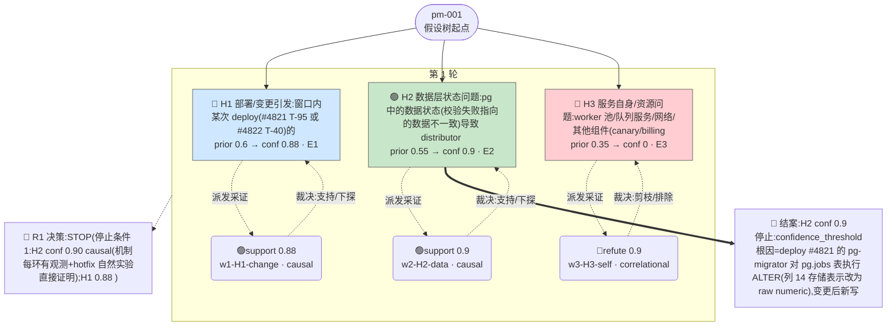

# 执行决策树 — pm-001-orchestrated-001

- 臂:`orchestrated` | 案例层级:`l3-postmortem` | 预算:`4` 轮 | 终态:`root_cause_concluded`
- 证据 `3` 条(correlational 1 / causal 2);轮次记录 `1`
- 评分:verdict=`located`,关键词命中 `10`(`#4821,deploy,ALTER,字段,类型,validation,混合,migrator,反向迁移,hotfix-ignore-field`),误归因 `0`,需复核=`false`

> 本图由 `tools/render-tree.mjs` 从 state 机械生成;任何节点可回查 `runs/${runId}/state/*` 与 `analysis/scoring/${runId}.json`。节点色:🟢=concluded,🔵=supported,🔴=pruned/refuted,⚪=pending。

## 断言摘要(每条证据一句话,全文见 `runs/pm-001-orchestrated-001/state/evidence-chain.jsonl`)

| 证据 | 假设 | 轮 | verdict | conf | 类型 | 断言(截断)|
|------|------|----|---------|------|------|------------|
| E1 | H1 | 1 | support | 0.88 | causal | 支持(机制=变更遗留状态,非变更代码在跑):deploy #4821(T-95 启动/T-92 完成,targets=distributor-api+pg-migrator)的 m |
| E2 | H2 | 1 | support | 0.9 | causal | 成立(机制+时序完整):T-92 #4821 的 pg-migrator ALTER jobs 表→此后 ~13300 行新写入 column 14 呈 raw numeric,与 |
| E3 | H3 | 1 | refute | 0.9 | correlational | H3 不成立:(a) worker 池故障窗全程空闲健康(CPU 22-36%/内存 54-60%/GC 23-90ms);dispatch=0 与 worker 空闲同时成立→停 |
