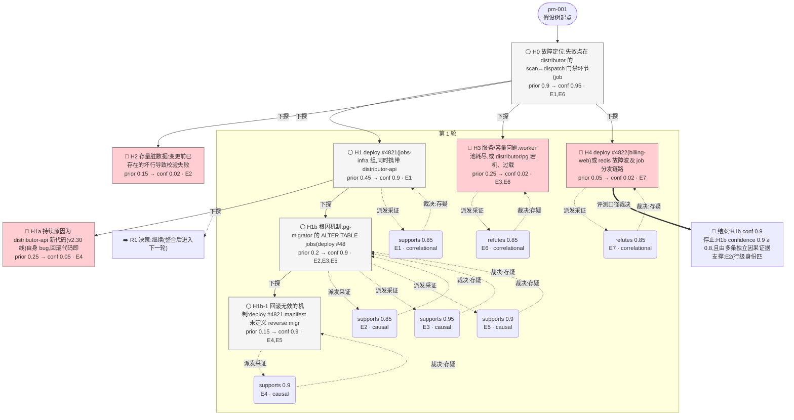

# 执行决策树 — pm-001-ralph-001

- 臂:`ralph-baseline` | 案例层级:`l3-postmortem` | 预算:`4` 轮 | 终态:`root_cause_concluded`
- 证据 `7` 条(correlational 3 / causal 4);轮次记录 `1`
- 评分:verdict=`located`,关键词命中 `9`(`#4821,deploy,ALTER,schema,字段,type mismatch,validation,migrator,hotfix-ignore-field`),误归因 `0`,需复核=`false`

> 本图由 `tools/render-tree.mjs` 从 state 机械生成;任何节点可回查 `runs/${runId}/state/*` 与 `analysis/scoring/${runId}.json`。节点色:🟢=concluded,🔵=supported,🔴=pruned/refuted,⚪=pending。

## 断言摘要(每条证据一句话,全文见 `runs/pm-001-ralph-001/state/evidence-chain.jsonl`)

| 证据 | 假设 | 轮 | verdict | conf | 类型 | 断言(截断)|
|------|------|----|---------|------|------|------------|
| E1 | H1 | 1 | supports | 0.85 | correlational | 故障起点与 deploy #4821 强时间耦合:deploy #4821(component_group=jobs-infra,targets=distributor-api,p |
| E2 | H1b | 1 | supports | 0.85 | causal | 行级身份匹配证明失败行起源于迁移本身:pg.log 记录 ALTER TABLE jobs 由 role=pg-migrator 执行(deploy #4821 migration |
| E3 | H1b | 1 | supports | 0.95 | causal | 分发停止是 distributor 校验门禁的 fail-closed 决策,而非扫描器/PG/worker 停摆:distributor.log 明确记录 'dispatch h |
| E4 | H1b-1 | 1 | supports | 0.9 | causal | T+15 回滚自然实验隔离出持续原因为 schema 而非代码版本:回滚于 T+18 完成,仅还原 distributor-api 至 v2.29,pg-migrator NOT  |
| E5 | H1b | 1 | supports | 0.9 | causal | 干预实验闭环因果:oncall 于 T+25 手工部署定制构建 hotfix-ignore-field-8803(名称指向忽略该字段校验)后,分发立即恢复(151/min@+25  |
| E6 | H3 | 1 | refutes | 0.85 | correlational | 容量/服务面排除:worker 全时段 CPU 22-36%、内存约 54-60%、gc_pause 多为 25-90ms,在故障起点(T-88)与恢复点(T+25)均无跳变,与' |
| E7 | H4 | 1 | refutes | 0.85 | correlational | billing-web/redis 干扰排除:deploy #4822 目标为 billing-web(topology 标记 kind=unrelated-service,与 d |
